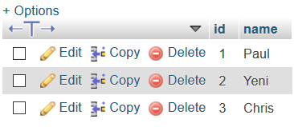

# JPAMysqlExample
Example of the JPA and Mysql Database integration

In this example, a database ("example_mysql") is created based on Msql

The fundamental classes are

<ul>
<li>Student</li>
<li>StudentInterface</li>
<li>DataLoader</li>
</ul>

The Student class is in charge of representing the model

The StudentInterface is in charge of create the JPA repository

The DataLoader class is in charge of populating the BD

The configuration of the connection with the mysql db is defined in the appliction properties file

<ul>
<li>spring.datasource.url=jdbc:mysql://localhost:3306/mysql_example?serverTimezone=UTC</li>
<li>spring.datasource.username=root</li>
<li>spring.datasource.password=</li>
<li>spring.jpa.hibernate.ddl-auto=create-drop</li>
<li>spring.jpa.show-sql=true</li>
</ul>

The final result is the creation and insertion of data in the student table

